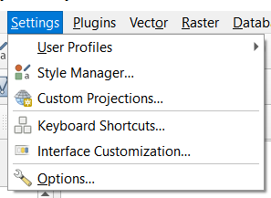
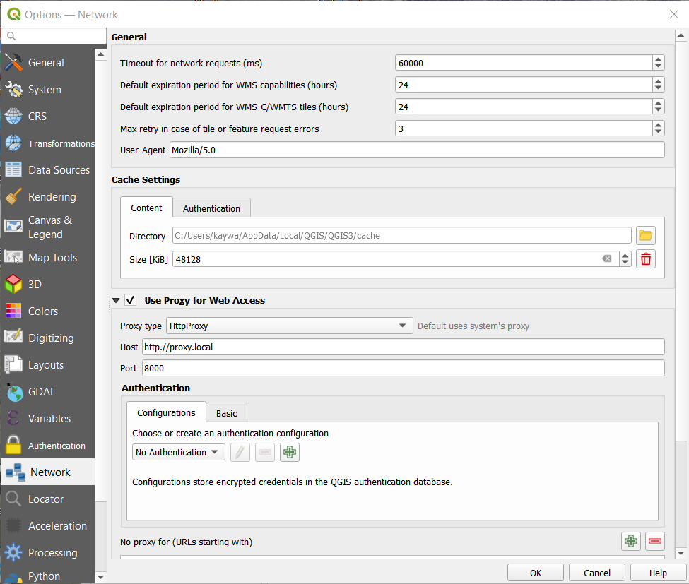

Proxy Settings
==============

Many enterprises secure their network with intermediary proxy-server the inspects external data comming into their network and then sends it through to client. In the past the plugin sometimes had problems on picking up these redirects because of the limitations of urllib library that was used until version 2.6. 

Since version 2.7 of the plugin, the plugin uses the native methods of QGIS to make to http-API calls. Including calls to the Dutch INSPIRE CSW-service_. This way all the QGIS-settings are used in a identical manner, so the user must configure everything only once.  

If QGIS does not automaticaly pick you enterprise Proxy.  You can configure this manually. Go on the menu-bar to *Settings/Options..* :

Then to the tab *Network*. Here can enable using proxy's and input the url and port if the system does not pick this up automaticaly:

More info: Network-Settings_

.. _CSW-service:  https://www.nationaalgeoregister.nl/geonetwork/srv/dut/inspire?request=GetCapabilities&service=CSW&version=2.0.2
.. _Network-Settings: https://docs.qgis.org/testing/en/docs/user_manual/introduction/qgis_configuration.html#network-settings