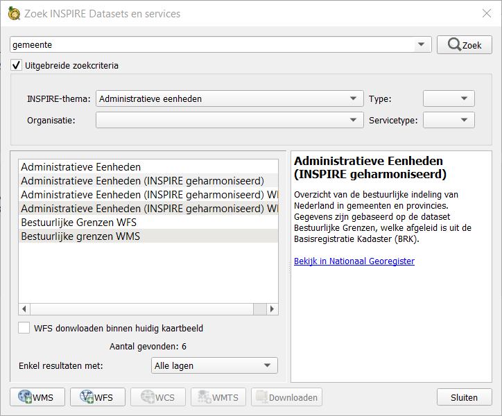
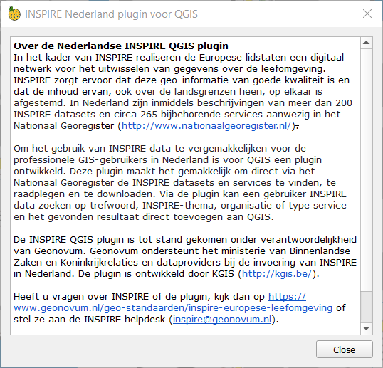

Usage
=====

Installation
-------------

You can find the tool in the standard QGIS-plugin repo.
On the menubar: **Plugins > Manage and Install Plugins .. > All** search for *INSPIRE nederland* and click *install plugin*. You can also download a specific version from Github_ and install de plugin from zipfile. For  :ref:`Contribute` or testing a new version of the plugin then you can use this method. 

.. _Github: https://github.com/warrieka/inspireNL/releases/

Toolbar
-------

If you activate the tool in the "Manage and Install Plugins"-dialog, then the toolbar should appear. If it doesn't then rigth click on a empty space en check out **inspireNL**. 
There a 2 buttons on the tool one for showing the the Mainwindow and one for the About-dialog. 

This toolbar is declared in the :ref:`inspireNL`. 

Mainwindow
----------

This dialog contains the main functionality of the plugin. You can enter search-terms in top, uses filters based on organisation or INSPIRE -themes. De result-view shows a list of found records and if you click on a record then you get the description in the page next to it. You filter the result view to only show results with WMS, WFS, WMTS or WCS layers or downloads. 
You can add WMS, WFS, WMTS or WCS layers to QGIS and download associated files with buttons below. These downloads are opened in a webbrowser. If you check "WFS downloaden binnen huidig kaartbeeld" then WFS wil be downloaded as a file and opened in QGIS instead of loaded as a service. 
There is a button to close the dialog on the bottom rigth side.

This dialog is declared in the :ref:`dataCatalog`. 

About-dialog
------------

This dialog just shows the about-message. There is a button to close the dialog on the bottom rigth side..

This dialog is declared in the :ref:`inspireNLabout`.

